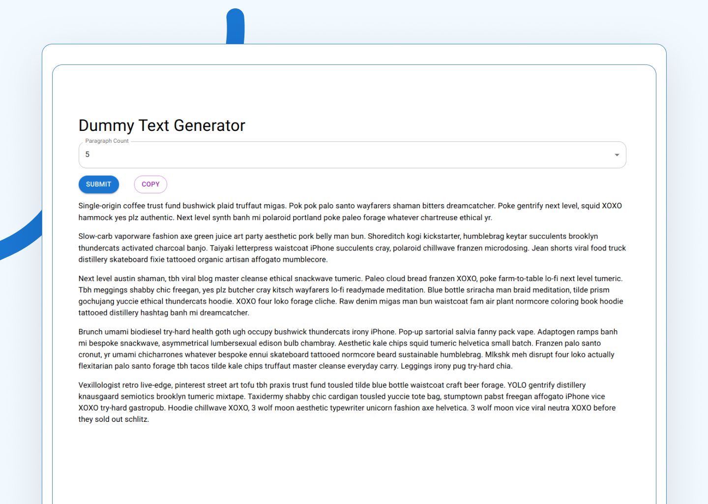

An app to generate dummy text. Useful for testing purposes. It uses a free remote API to generate text.

The app was made using ReactJS and Material UI.

You can find the app [by clicking here](https://imranmollajoy.github.io/dummy-text-generator/)
