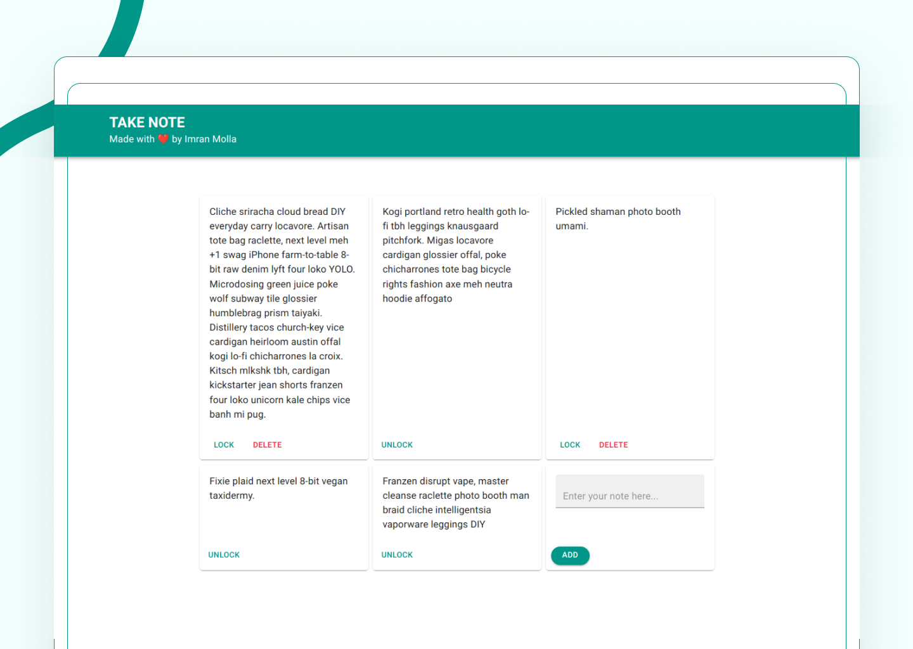

A simple app to take and save your note. It uses browsers' local storage to save your data.

This app was made using ReactJS and Material UI.

You can find the app [by clicking here](https://imranmollajoy.github.io/take-note-app)
